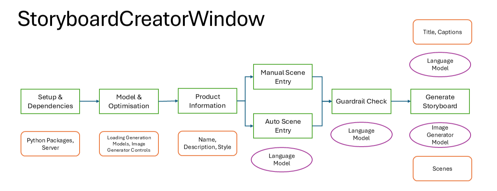

# 🎬 Multimodal AI Storyboard Generator

An **AI-powered, multi-stage pipeline** for generating professional product storyboards using **LLMs + diffusion models**.
Transform product ideas into structured scenes and visually coherent storyboards in minutes.

---

## 🚀 Overview

Creating storyboards for product presentations is time-consuming and often inconsistent.

This project automates the entire workflow:

* 🧠 Generate structured scenes from product input
* 🛡️ Validate content using guardrail models
* 🎨 Generate high-quality images using diffusion models
* 🧩 Combine outputs into a complete storyboard

👉 Result: **Production-ready storyboards in minutes instead of hours**

---

## 🧠 Key Features

* **Multimodal AI Pipeline** (LLM + Diffusion Models)
* **Multi-Scene Storyboard Generation**
* **Product-Aware Prompt Enhancement**
* **Guardrail Validation (LLM-based safety checks)**
* **Real-Time Generation Tracking**
* **VRAM Optimization (CPU offload, FP16, tiling)**
* **Metadata Logging for Reproducibility**
* **Interactive UI (React + TypeScript)**

---

## 🏗️ System Architecture



This project follows a **multi-stage AI pipeline architecture**:

1. **Input Layer**

   * Product name, description, style

2. **Scene Generation**

   * Manual input OR LLM-generated scenes

3. **Guardrail Layer**

   * LLM-based validation for safe and clean prompts

4. **Image Generation**

   * Diffusion models (SDXL, SD v1.5, RealVisXL)

5. **Output**

   * Scene images + composite storyboard + metadata

---

## 🛠️ Tech Stack

### Backend

* FastAPI
* PyTorch
* Hugging Face Diffusers
* Transformers
* Llama.cpp (Guardrail LLM)

### Frontend

* React
* TypeScript

### Models

* Stable Diffusion XL (SDXL)
* Stable Diffusion v1.5
* RealVisXL
* Llama 3.1 / Qwen (Guardrails)

---

## ⚡ Quick Start

```bash
git clone <your-repo-url>
cd StoryboardCreator

# Create environment
python -m venv storyboard_venv
source storyboard_venv/bin/activate  # Windows: storyboard_venv\Scripts\activate

# Install dependencies
pip install -r requirements.txt

# Run server
python storyboard_server.py
```

Then open the UI and:

1. Load a model
2. Enter product details
3. Add scenes (or auto-generate)
4. Click **Generate Storyboard**

---

## 📸 Example Workflow

1. Input product: *“Wireless Noise-Cancelling Headphones”*
2. Generate scenes:

   * Hero product shot
   * Feature showcase
   * Lifestyle usage
3. AI generates images for each scene
4. Outputs a complete storyboard

---

## 📊 Performance

* ⏱️ ~30–60 sec per scene (SD v1.5)
* 🎬 ~3–5 min for full storyboard (5 scenes)
* 💾 Optimized for low VRAM GPUs (e.g., MX450)

---

## 🧩 Key Highlights

* **Multi-model orchestration** (LLM + diffusion + guardrails)
* **Production-ready pipeline design**
* **Optimized for real-world hardware constraints**
* **End-to-end system (UI + backend + models)**

---

## ⚠️ Notes

* SDXL may require higher VRAM
* For low-end GPUs, use **SD v1.5 with lower CFG and steps**
* Guardrail models run locally via GGUF (llama.cpp)

---

If you want, I can also:

* Make this **look like a top 1% GitHub repo (badges, GIFs, demo section)**
* Or tailor it specifically for **job applications / recruiters**
